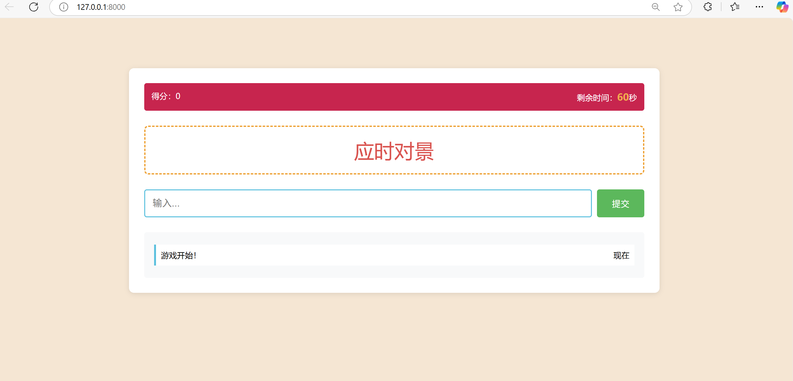
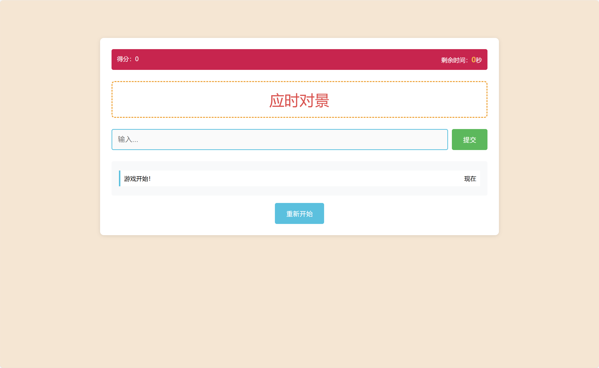
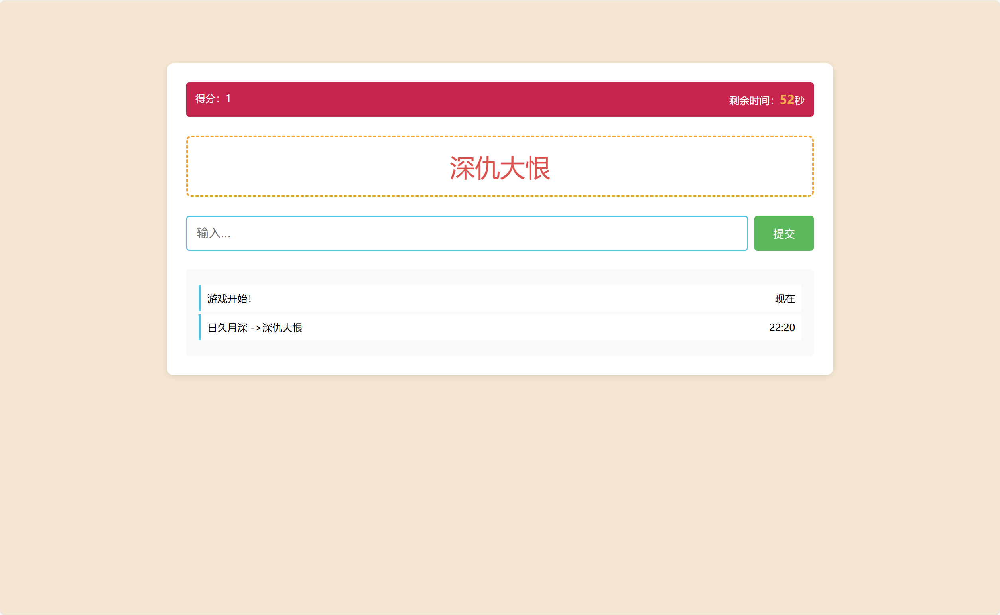

# OrbitDo

#### 运行方式
- 本地  >> python manage.py runserver 即可运行啦
- 恢复登录注册功能：
修改 OrbitDo/urls.py 去掉注释

```python
urlpatterns = [
    # path('', HomePage, name='home'),
    # path('admin/', admin.site.urls),  
    # path('login/', LoginPost, name='login'),  
    # path('register/', RegisterPost, name='register'),
    # path('todolist/', Todolist, name='todolist'),
    # path('guess/', Guess, name='guess'),
    path('', Guess, name='guess'),
    path('returnanswer/',ReturnAnswer,name='returnanswer')
]
```
记得把
```python
path('returnanswer/',ReturnAnswer,name='returnanswer')
```
重新注释起来

#### 游戏开始界面



#### 游戏结束界面


#### 游戏运行界面
